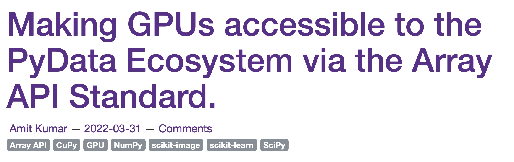
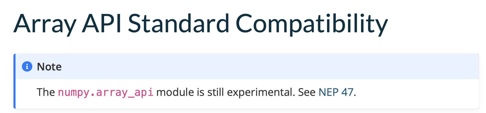
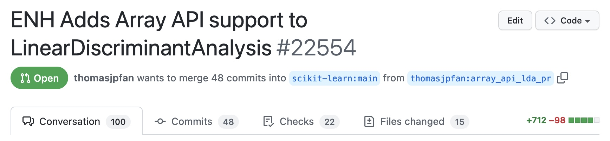

title: Adopting Array API in Scikit-learn
use_katex: False
class: title-slide

# Adopting Array API in Scikit-learn


.larger[Thomas J. Fan]<br>
@thomasjpfan<br>
<a class="this-talk-link", href="https://github.com/thomasjpfan/qshare-2022-array-api-scikit-learn" target="_blank">
This talk on Github: thomasjpfan/qshare-2022-array-api-scikit-learn</a>

---

# Results
## 13x faster on GPU compared CPU 🚀

.g.g-middle[
.g-6[
```python
%%time
lda_np.fit(X_np, y_np)

*# Wall time: 14.7 s
```
]
.g-6[
```python
set_config(array_api_dispatch=True)

X_cu = xp.asarray(X_np, copy=True)
y_cu = xp.asarray(y_np, copy=True)

%%time
lda_cu.fit(X_cu, y_cu)
*# Wall time: 1.08 s
```
]
]

---

class: chapter-slide

# 7 Constraints 🔓

---

class: center

# Maintain contributor ergonomics ⌨️
## More for a contributor to know


---

class: center

# No Chained Methods

.g[
.g-6[

.center[
### 🛑
]

```python
(X.mean(axis=1) > 1.0).any()
```
]
.g-6[

.center[
### ✅
]

```python
xp.any(xp.mean(X, axis=1) > 1.0)
```
]
]

---

# Array API functions do not work with Python Scalars

.g[
.g-6[

.center[
### 🛑
]

```python
x = 3.14159
x_sqrt = np.sqrt(x)
```
]
.g-6[

.center[
### ✅
]

```python
x = 3.14159
x_sqrt = math.sqrt(x)
```
]
]

---

# No `asarray` does not have `order`

.g[
.g-6[

.center[
### 🛑
]

```python
x = np.asarray(
    [[1.2, 3.4],
     [  1, 3.4]], order="F")
```
]
.g-6[

.center[
### ✅
]

```python
x = _asarray_with_order(
    [[1.2, 3.4],
     [  1, 3.4]], order="F")
```
]
]

---

# No `asarray` does not have `order`

```python
def _asarray_with_order(array, dtype=None, order=None, copy=None, xp=None):
     if xp is None:
        xp, _ = get_namespace(array)

*    if xp.__name__ in {"numpy", "numpy.array_api"}:
*        # Use NumPy API to support order
*        array = numpy.asarray(array, order=order, dtype=dtype)
*        return xp.asarray(array, copy=copy)
    else:
        return xp.asarray(array, dtype=dtype, copy=copy)
```


---

# Integer indexing

.g[
.g-6[

.center[
### 🛑
]

```python
X = np.asarray([1.2, 3.4, 2.4, 1.3])
X_sliced = X[np.asarray([1, 2])]
```

]

.g-6[

.center[
### ✅
]

```python
xp = get_namespace(X)
X_sliced = xp.take(
    X, xp.asarray([1, 2]))
```
## Not in spec yet
]
]

---

class: chapter-slide

# Supporting NumPy and Array API 🔌

---

# Supporting NumPy and Array API 🔌

```python
class _ArrayAPIWrapper:
    def take(self, X, indices, *, axis):
        # implements `take` using Array API
```

---

# Supporting NumPy and Array API 🔌

```python
class _NumPyApiWrapper:
    def unique_inverse(self, x):
        return numpy.unique(x, return_inverse=True)
```

---

class: chapter-slide

# Testing on different API implementations 🔬

---

class: chapter-slide

# Why? 🤔

---

class: chapter-slide

# Trust 🤖

---

class: chapter-slide

# Good User API 🛠

---

# Good User API 🛠

<!-- Example of current API -->
```python
X_cu = xp.asarray(X_np)
y_cu = xp.asarray(y_np)

*with config_context(array_api_dispatch=True):
    lda = LinearDiscriminantAnalysis()
    X_trans = lda.fit_transform(X_cu, y_cu)
```

---

class: chapter-slide

# Enable common user stories 📚

---


# Enable common user stories 📚
## Train on GPU & deploy on CPU

```python
from sklearn.utils._array_api import _convert_estimator_to_ndarray

*lda_np = _convert_estimator_to_ndarray(lda)
X_trans = lda_np.transform(X_np)
```

---

class: chapter-slide

# Extensions for dask or JAX 🪢

---

# Extensions for dask or JAX 🪢
## Requires workarounds

- `nonzero`
- `unique_all`
- `unique_counts`
- `unique_inverse`
- `unique_values`

---

class: chapter-slide

# Maintainer Bandwidth 🕰

---



### [labs.quansight.org/blog/2022/03/making-gpus-accessible-to-pydata-ecosystem-via-array-api/](https://labs.quansight.org/blog/2022/03/making-gpus-accessible-to-pydata-ecosystem-via-array-api/)

---



### [https://numpy.org/devdocs/reference/array_api.html](https://numpy.org/devdocs/reference/array_api.html)

---

class: center

# Many Challenges ⛵️
## 13x faster on GPU compared CPU 🚀


